# Diabetes Risk Prediction – Notebook Outputs

Plots and results extracted from `diabeties-prediction.ipynb`. All images are in the [`images/`](images/) folder.

**Dataset:** `diabetes_risk.csv` (Kaggle) – 15,000 patients, 18 features, no duplicate rows.
**Target:** `diabetes_risk` – Low (9,000), Moderate (3,750), High (2,250).
**Missing values:** `smoking_status` (472), `alcohol_consumption` (3,788), `income_bracket` (463) → filled with `"unknown"`.

---

## 1. Exploratory Data Analysis

### Target class distribution
The classes are imbalanced: Low is 60%, Moderate 25%, High 15%.

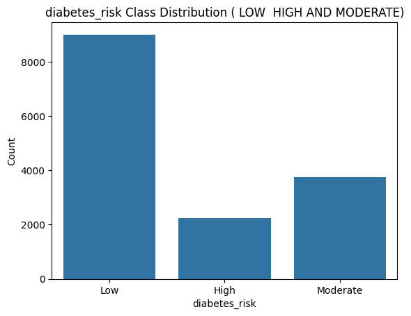

### Numeric feature histograms
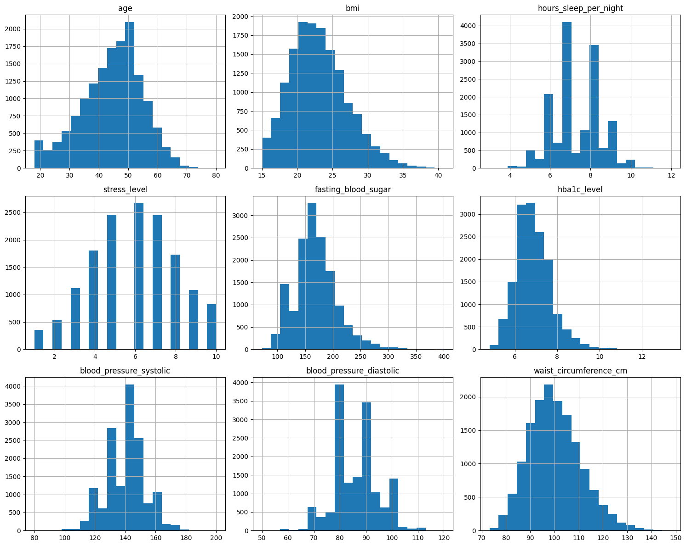

### Categorical feature distributions

| | |
|---|---|
| 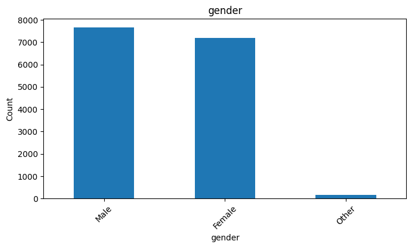 | 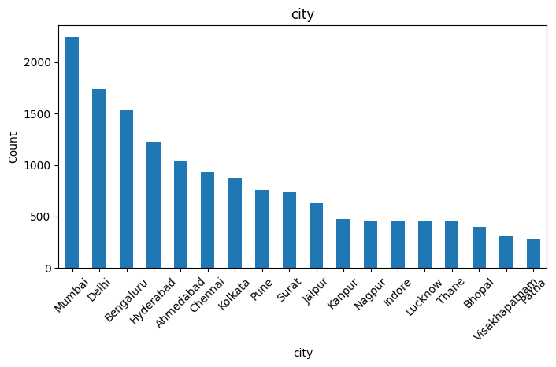 |
| 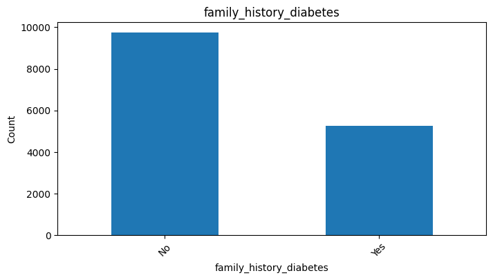 | 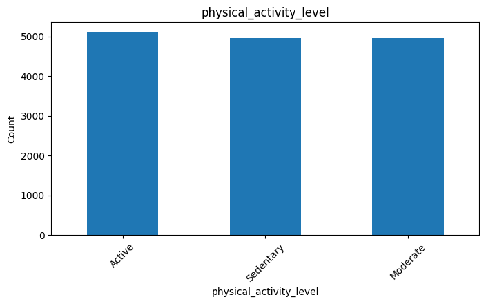 |
| 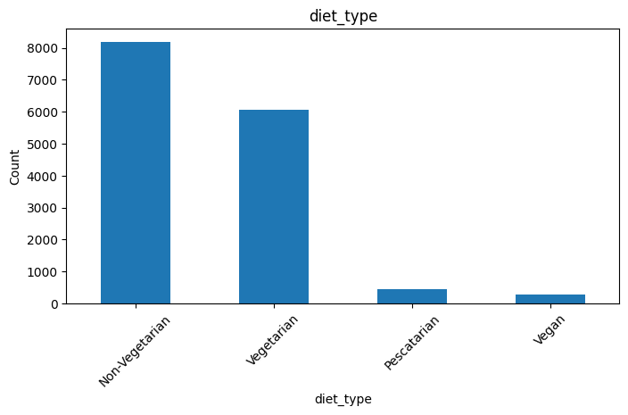 | 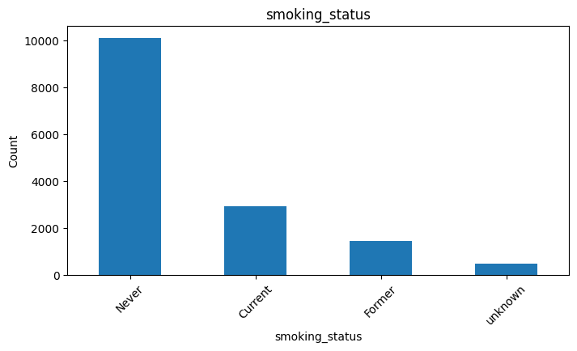 |
| 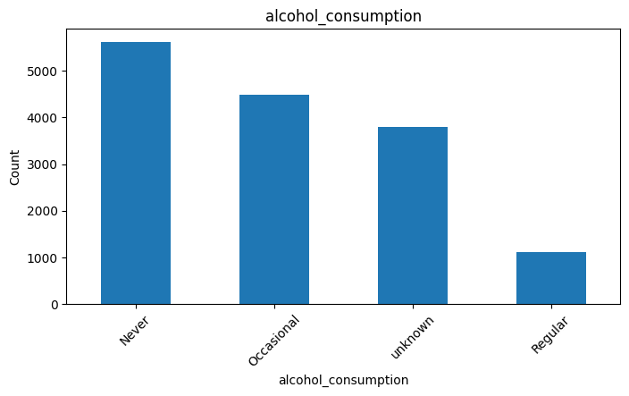 | 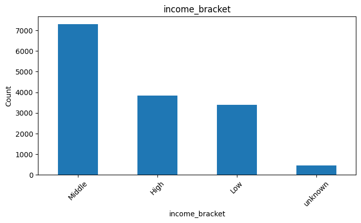 |

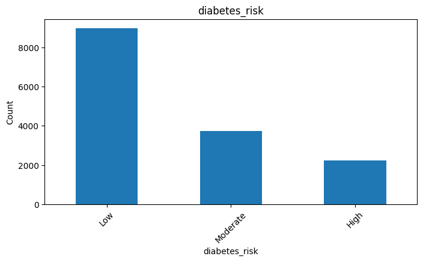

### Correlation heatmap
Strong correlations: `fasting_blood_sugar` ↔ `hba1c_level` (0.91) and `bmi` ↔ `waist_circumference_cm` (0.94). Age ↔ systolic BP is moderate (0.48).

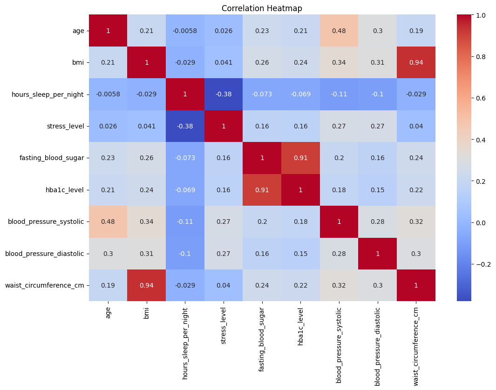

---

## 2. Feature engineering & preprocessing
- Dropped `patient_id`; label-encoded categorical columns.
- Added clinical categories: `bmi_category` (WHO ranges), `hba1c_category` (Normal / Prediabetes / Diabetes), `bp_category` (Low → Hypertensive crisis).
- 80/20 train/test split (`random_state=42`), `StandardScaler` for scale-sensitive models.

## 3. Model comparison (5-fold stratified CV, macro F1)

| Model | CV Mean F1 | CV Std |
|---|---|---|
| Logistic Regression | 0.7394 | 0.0074 |
| Gradient Boosting | 0.7367 | 0.0065 |
| Random Forest | 0.7354 | 0.0051 |
| XGBoost | 0.7322 | 0.0070 |
| SVM | 0.7304 | 0.0043 |
| Bagging | 0.7303 | 0.0082 |
| Hist Gradient Boosting | 0.7275 | 0.0083 |
| AdaBoost | 0.7229 | 0.0086 |
| Extra Trees | 0.7024 | 0.0120 |
| Naive Bayes | 0.6847 | 0.0116 |
| Decision Tree | 0.6826 | 0.0117 |
| KNN | 0.6346 | 0.0087 |

## 4. Test-set results of top models

| Model | Accuracy | Precision | Recall | F1 (macro) |
|---|---|---|---|---|
| Random Forest | 0.8037 | 0.7753 | 0.7457 | 0.7591 |
| Logistic Regression | 0.8023 | 0.7666 | 0.7466 | 0.7559 |
| Gradient Boosting | 0.8017 | 0.7678 | 0.7419 | 0.7538 |

### Random Forest – confusion matrix
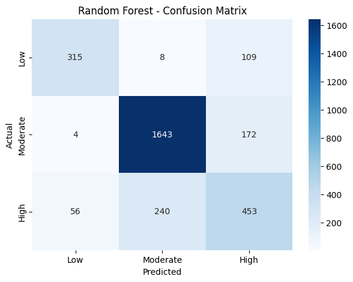

## 5. Hyperparameter tuning (RandomizedSearchCV)
Best params: `n_estimators=150, max_depth=20, min_samples_split=10, min_samples_leaf=1, max_features='log2', class_weight='balanced_subsample'` – best CV macro F1 **0.7402**.

| Metric | Tuned RF |
|---|---|
| Accuracy | 0.7993 |
| Precision (macro) | 0.7649 |
| Recall (macro) | 0.7621 |
| F1 (macro) | **0.7627** |

### Tuned Random Forest – confusion matrix
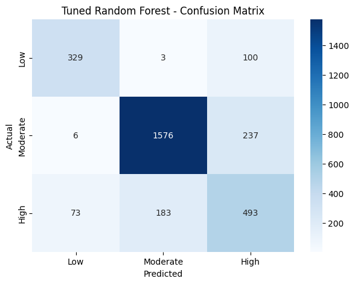

## 6. Stacking experiments

| Ensemble | Accuracy | F1 (macro) |
|---|---|---|
| Stacking (LR meta-learner) | 0.8060 | 0.7593 |
| Stacking (RF meta-learner) | 0.8010 | 0.7543 |

## 7. Final model
The **tuned Random Forest** was selected because it has the best macro F1 (**76.27%**) and the best recall on the minority High-risk class. It is saved as `diabetes_risk_model.pkl` with feature order in `diabetes_risk_features.pkl`.

---

> **Note on class labels:** the notebook's confusion matrices and classification reports label classes as `Low, Moderate, High`, but `LabelEncoder` sorts alphabetically, so the actual encoding is `0 = High, 1 = Low, 2 = Moderate`. The class supports (432 / 1819 / 749) confirm this. The images above are reproduced exactly as in the notebook, so their axis labels are in the wrong order. Also, `x_test` is scaled with `fit_transform` instead of `transform`, which should be fixed.
